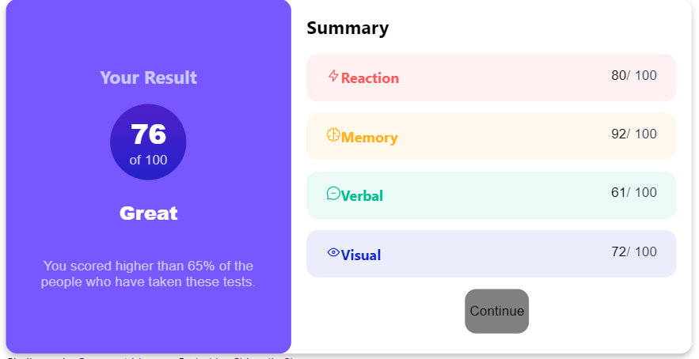

# Frontend Mentor - Results summary component solution

This is a solution to the [Results summary component challenge on Frontend Mentor](https://www.frontendmentor.io/challenges/results-summary-component-CE_K6s0maV). Frontend Mentor challenges help you improve your coding skills by building realistic projects.

## Table of contents

- [Overview](#overview)
  - [The challenge](#the-challenge)
  - [Screenshot](#screenshot)
  - [Links](#links)
- [My process](#my-process)
  - [Built with](#built-with)
  - [What I learned](#what-i-learned)
  - [Continued development](#continued-development)
  - [Useful resources](#useful-resources)
- [Author](#author)
- [Acknowledgments](#acknowledgments)

**Note: Delete this note and update the table of contents based on what sections you keep.**

## Overview

### The challenge

Users should be able to:

- View the optimal layout for the interface depending on their device's screen size
- See hover and focus states for all interactive elements on the page

### Screenshot



Add a screenshot of your solution. The easiest way to do this is to use Firefox to view your project, right-click the page and select "Take a Screenshot". You can choose either a full-height screenshot or a cropped one based on how long the page is. If it's very long, it might be best to crop it.

Alternatively, you can use a tool like [FireShot](https://getfireshot.com/) to take the screenshot. FireShot has a free option, so you don't need to purchase it.

Then crop/optimize/edit your image however you like, add it to your project, and update the file path in the image above.

**Note: Delete this note and the paragraphs above when you add your screenshot. If you prefer not to add a screenshot, feel free to remove this entire section.**

### Links

- Solution URL: [Add solution URL here](https://your-solution-url.com)
- Live Site URL: [Add live site URL here](https://your-live-site-url.com)

## My process

1. First, create design the frame of the html, it would look like

```react
<Card>
  <Cardleft>
    <Title/>
    <Circle/>
    <Sbutitle/>
    <Description/>
  <Cardleft/>
  <Cardright>
  <Title/>
  <Score>
  <Cardright/>
</Card>

```

2. For the `Left Part`, I create the element at first, and then use `display: flex` to adjust the content.

- flex-direction: print the items from the top to bottom
- align-center: set items in the middle of y-axis
- justify-content: set items in the middle of x-axis

3. For the `Right Part`, I create the score part by the `data` from `data.json` and create div element

4. To do responsive design, I apply Grid from [MUI](https://mui.com/material-ui/react-grid/).If screen is mobile size(xs), each part of the card would occupy the whole row of the card; If screen is windows size(lg), left part would oppucy 4/12 of the card, wihle left occupy 8/12.

### Built with

- [React](https://reactjs.org/) - JS library
- [MUI](https://https://mui.com/) - To apply grid


### What I learned

## Figma is not useful but good to learn CSS

When the component become flexable, I found that is not easy to copy the code through form Figma. So I decide to learn some css frame work (such as `flex`).However, since I'm not familiar with css, I would draw the element in the Figma, and look how the code may be like.

## Create by React while the component is repeated

I found that most of structure in the right part is repeated, so I decide to get the div `css` from the `data.json`, and create the component in react since it is more efficient. It's exciting to learn how to get data from js.


### Continued development

This can customize the result from the google form


### Useful resources

- [MUI](https://https://mui.com/) - There's lots of UI desing here.
- [Results Summary Component - Frontend Mentor Challenge #tsbsankara](https://www.youtube.com/watch?v=0JPS0PDLaSw&t=2558s&ab_channel=TsbSankara) - This is an react example for this project.
- [How to Push Folders From Local PC to GitHub using Git Commands?](https://www.geeksforgeeks.org/how-to-push-folders-from-local-pc-to-github-using-git-commands/) - Learn how to update folder to the github


## Author

- Website - [Chious](https://github.com/Chious)
- Frontend Mentor - [@Chious](https://www.frontendmentor.io/profile/Chious)
- Twitter - [@Chious](https://twitter.com/ChiouJiaSheng)


## Acknowledgments

Nope
